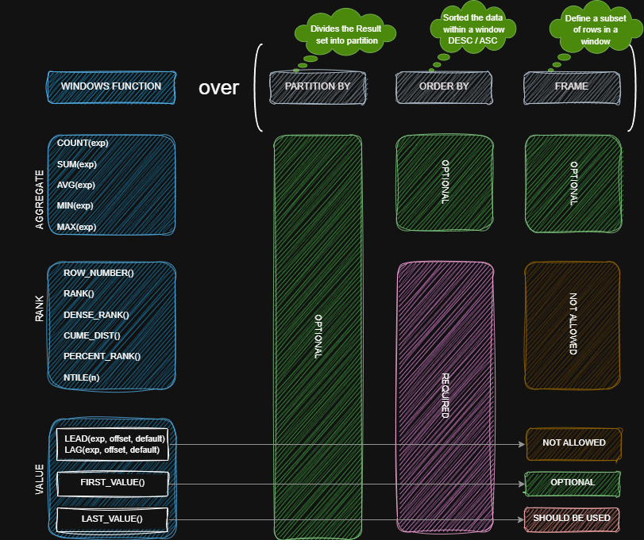
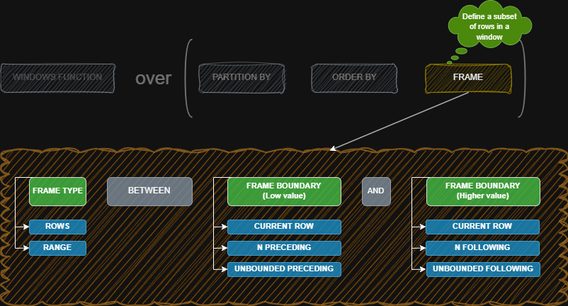

# 📘 SQL Learning

Welcome to my SQL learning repository!  
Here I share my SQL code, small projects, and data analysis.

## 🧩 Contents

- [`🕹️ Game Store Project`](#-game-store-project)
- [`🪟 Window Functions`](#-window-functions)
- [`📊 Analysis`](#-analysis)
- [`🛠️ Tools Used`](#-tools-used)
- [`🎯 My Goal`](#-my-goal)
- [`🤝 Contributing`](#-contributing)

---

## 🎮 Game Store Project

This is a simple database for a fake game store.  
I use it to learn how to:

- Create tables
- Use foreign keys
- Write SELECT queries
- Analyze sales and customers

### 🗺️ Database Diagram


### 🧱 Tables in the Project

- `Customer` – People who buy games  
- `Address` – Customer address  
- `Employee` – Store workers  
- `Purchase` – Orders from customers  
- `Purchase_item` – Items in each order  
- `Product` – Games in the store  
- `Category` – Type of game (Action, Adventure, etc.)

You can find the SQL code in the [Game Store folder](./Game%20Store%20Project) <!-- Edite se o nome da pasta for diferente -->

---

## 🪟 Window Functions
It is a performe calculations on a specififc subset of data, without losing the level of details of rows.
It return a single row for each row. The granularity stay the same.

### Windows Function Syntax





#### This code is an example of how to use window functions in SQL.
```sql
SELECT
  purchase_id,
  purchase_date,
  
  -- Previous and next values
  LAG(total_price, 2, 0) OVER (ORDER BY purchase_date, purchase_id) AS total_2_rows_before,
  total_price AS total_per_purchase,
  LEAD(total_price, 1, 0) OVER (ORDER BY purchase_date, purchase_id) AS total_1_row_after,
  
  -- Total per date
  SUM(total_price) OVER (PARTITION BY purchase_date) AS total_per_day,
  ROW_NUMBER() OVER (PARTITION BY purchase_date ORDER BY total_price DESC) AS rank_by_daily_total,
  
  -- Cumulative total up to the current row
  SUM(total_price) OVER (
    ORDER BY purchase_date, purchase_id 
    ROWS BETWEEN UNBOUNDED PRECEDING AND CURRENT ROW
  ) AS cumulative_total,
  
  -- Grand total
  SUM(total_price) OVER () AS grand_total
  
FROM purchase
WHERE purchase_date >= '2024-01-01'
ORDER BY purchase_date, purchase_id
LIMIT 1000;
```
Find the code [here](./window-functions) <!-- Edite conforme o caminho real -->

---
## Function and Trigger Structure
### Function
```sql
 CREATE OR REPLACE FUNCTION function_name()
 RETURNS return_type AS $$
 BEGIN
     -- function logic here
     RETURN ...;
 END;
 $$ LANGUAGE plpgslq;
```

### Trigger
```sql
 CREATE TRIGGER trigger_name()
 { BEFORE | AFTER | INSTEAD OF }
 { INSERT OR UPDATE OR DELETE } ON table_name
 FOR EACH ROW
 EXECUTE { PROCEDURE | FUNCTION } name();
```

---
## 📊 Analysis

This directory contains descriptive and investigative analysis using SQL.  
Inside the `Description and Investigation` folder, you will find the SQL files used for deeper data exploration and reporting.

Explore the SQL scripts [here](./Analysis)

---

## 🛠️ Tools Used

- **PostgreSQL** – SQL database
- **DBeaver / pgAdmin** – Tools to manage the database
- **VS Code** – Editor for SQL code

---

## 🎯 My Goal

I want to:

- Practice English and SQL
- Create small but real projects
- Learn step by step with fun ideas

---

## 🤝 Contributing

This is a study project.  
But you can give ideas or tips.  
Feel free to open an issue!

---
 
