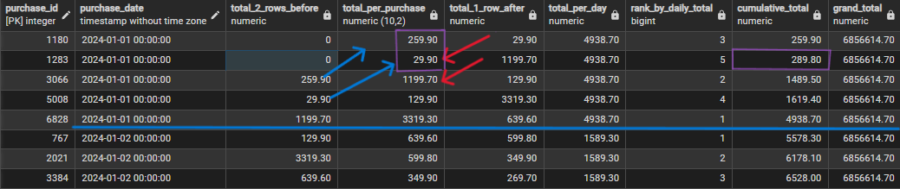
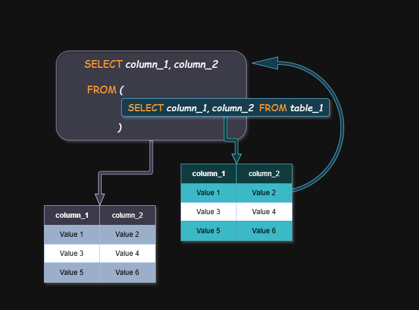
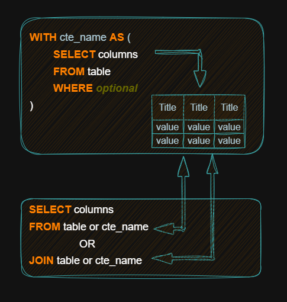

[](https://www.postgres.org/)
[]()
# 📘 SQL Learning

Welcome to my SQL learning repository. This is a personal space where I practice and organize everything I learn about SQL, especially advanced topics. I use simple examples, real-world projects, and clear comments in the code to help me understand each concept step by step. My goal is to improve my SQL skills, learn how to write better queries, and practice English at the same time. You will find topics like window functions, subqueries, joins, functions, triggers, and more.

## 🧩 Contents
- [x] [`🛢️ Game Store Project`](#-game-store-project)
- [x] [`🧩 Window Functions`](#-window-functions)
- [x] [`🧩 Subqueries and CTEs`](#-sql-subqueries)
- [x] [`🧩 CTE - Common Table Expressions`](#-sql-ctes-common-table-expressions)
- [x] [`🧩 Set Operations`](#sql-set-operations)
- [x] [`🧩 Function and Procedure Structure`](#function-and-procedure-structure)
- [x] [`🧩 Trigger`](#-trigger)
- [x] [`🧩 Conditional Logic`](#-conditional-logic) 
- [ ] 🧩 Text and Cleaning Functions
- [ ] 🧩 Query Performance
- [ ] 🧩 Views and Security
- [ ] [`📊 Analysis`](#-analysis)
- [x] [`🛠️ Tools Used`](#-tools-used)
- [x] [`🎯 My Goal`](#-my-goal)
- [x] [`🤝 Contributing`](#-contributing)

## 🎮 Game Store Project

The Game Store Project is a small database I created to help me learn SQL in a practical way. It simulates a simple video game store, with tables for customers, employees, products, purchases, and categories. I use this project to practice creating tables, writing queries, using foreign keys, and analyzing data like sales and customer behavior. This project helps me apply what I learn in real situations and makes studying more interesting.

### Database Diagram
<p align="center">
  
</p>


### Tables in the Project

- `Customer` – People who buy games  
- `Address` – Customer address  
- `Employee` – Store workers  
- `Purchase` – Orders from customers  
- `Purchase_item` – Items in each order  
- `Product` – Games in the store  
- `Category` – Type of game (Action, Adventure, etc.)

You can find the SQL code in the [Game Store folder](./Game%20Store%20Project) <!-- Edite se o nome da pasta for diferente -->

[`⬆️Back to Top`](#-Contents)

------------------------------------------------------------------------------------------------

## 🧩 Window Functions
A window function is a special SQL function.
It does a calculation across rows, but it keeps all the rows in the result.

It does not reduce the number of rows like `GROUP BY` does.

### When to Use Window Functions

Use a window function when you want to:

- Give a row number to each row → `ROW_NUMBER()`
- Find the rank of each row → `RANK()`, `DENSE_RANK()`, `PERCENT_RANK()`
- Find the relative position inside a group → `CUME_DIST()`, `NTILE()`
- Compare a row to the next or previous → `LEAD()`, `LAG()`
- Get the first or last value in a group → `FIRST_VALUE()`, `LAST_VALUE()`
- Make a running total → `SUM() OVER(...)`
- Find a running average → `AVG() OVER(...)`
- Get the highest or lowest value in a group → `MAX() OVER(...)`, `MIN() OVER(...)`
- Count how many rows in a group → COUNT() OVER(...)
- Use aggregate functions but keep row details → any function with `OVER(...)`

### Windows Function Syntax
<p align="center">
  
</p>

<p align="center">
  
</p>


#### This code is an example of how to use window functions in SQL.
```sql
SELECT
  purchase_id,
  purchase_date,
  
  -- Previous and next values
  LAG(total_price, 2, 0) OVER (ORDER BY purchase_date, purchase_id) AS total_2_rows_before,
  total_price AS total_per_purchase,
  LEAD(total_price, 1, 0) OVER (ORDER BY purchase_date, purchase_id) AS total_1_row_after,
  
  -- Total per date
  SUM(total_price) OVER (PARTITION BY purchase_date) AS total_per_day,
  ROW_NUMBER() OVER (PARTITION BY purchase_date ORDER BY total_price DESC) AS rank_by_daily_total,
  
  -- Cumulative total up to the current row
  SUM(total_price) OVER (
    ORDER BY purchase_date, purchase_id 
    ROWS BETWEEN UNBOUNDED PRECEDING AND CURRENT ROW
  ) AS cumulative_total,
  
  -- Grand total
  SUM(total_price) OVER () AS grand_total
  
FROM purchase
WHERE purchase_date >= '2024-01-01'
ORDER BY purchase_date, purchase_id
LIMIT 1000;
```


🔎 Find the code [here](./window-functions)

🧑‍💻 [Learn more](https://datawithbaraa.substack.com/p/your-guide-to-sql-window-functions?utm_source=publication-search)

[`⬆️Back to Top`](#-Contents)

------------------------------------------------------------------------------------------------

## 🧩 SQL Subqueries

### Overview
Subqueries are queries written inside other queries. They work like nested boxes - the inner query (subquery) runs first and provides results to the outer query (main query).

### Basic Concept
```sql
  SELECT column_name 
  FROM table_name 
  WHERE column_name > (SELECT AVG(column_name) FROM table_name);
```
### Types of Subqueries
#### Single Value Subqueries
- Return one result (number, text, date)
- Used with operators: =, >, <, >=, <=, <>
- Example: Find products above average price

#### Multiple Value Subqueries
- Return multiple results
- Used with: IN, ANY, ALL, EXISTS
- Example: Find customers in cities with stores

#### Common Locations
|Location  | Purpose                   | Example Use                |
| -------- | ------------------------- | -----------                |
|WHERE     | Filter data               | Find records above average |
|SELECT    | Add calculated columns    | Show percentage of total   | 
|FROM      | Use results as temp table | Complex data combinations  |

### Key Points
- Subqueries execute before the main query
- Can be nested multiple levels deep
- May impact performance with large datasets
- Often replaceable with JOINs for better speed
- Useful for breaking complex problems into steps

### Best Practices
- Keep subqueries simple when possible
- Consider JOIN alternatives for performance
- Test with small data sets first
- Use meaningful aliases for readability

<p align="center">
  
</p>

🔎 Find the code [here](./subqueries)

🧑‍💻 [Learn more](https://datawithbaraa.substack.com/p/sql-subqueries-a-comprehensive-guide?utm_source=publication-search)

[`⬆️Back to Top`](#-Contents)

------------------------------------------------------------------------------------------------

## 🧩 SQL CTEs (Common Table Expressions)

### Overview
CTEs stands for "Common Table Expressions." They are a useful feature in SQL databases that let you create temporary named result sets within a query.
Used to simplify writing complex queries, it helps break down logic into smaller parts making them easier to understand.

Basic Concept
```sql
  WITH cte_name AS (
    SELECT column1, column2
    FROM table_name
  )
  SELECT *
  FROM cte_name;
```

### Types of CTEs:
 - Non-Recursive CTE: Used to structure and simplify queries.
 - Recursive CTE: Used for hierarchical or tree-structured data.
 - Nested CTE: When a CTE dependend on the other CTE

### Use Cases
|Purpose	| Example Use |
|-------- | ----------- |
| Simplify complex queries | Break down into readable steps|
| Reuse a result set | Join same result multiple times |
| Recursive queries |	Hierarchical data like org charts, trees. |
| Temporary aggregations |	Pre-compute totals, counts, rankings |

### Key Points
- CTE is temporary, valid only for that query
- Defined with WITH keyword before the main query
- Can use multiple CTEs, separated by commas
- Recursive CTEs must include UNION ALL
- CTEs often replace subqueries or derived tables

### Best Practices
- Rethink and refactor your CTEs before starting a new one.
- Don't use more than 5 CTEs in one query; otherside, your code will be hard to understand and maintain.
- Favor CTEs over deeply nested subqueries.
- Test performance with large datasets.
- Use descriptive names for CTEs.
  
### ❌ Attention
We don’t use the ORDER BY clause directly in CTEs unless it's combined with a TOP or LIMIT clause, or you're using it inside a subquery that supports ordering.

<p align="center">
  
</p>

🔎 Find the code [here](./cte-common-table-expressions)

🧑‍💻 [Learn more](https://datawithbaraa.substack.com/p/sql-ctes-a-comprehensive-guide?utm_source=publication-search)

[`⬆️Back to Top`](#-Contents)

------------------------------------------------------------------------------------------------

## 🧩 SQL Set Operations

SQL set operations allow you to combine results from multiple SELECT statements into a single result set. These operations work similarly to mathematical set operations and are used to merge data from different queries

### Main SQL Set Operations

1. **UNION**
  - Combines results from two or more SELECT statements
  - Removes duplicate rows
  - Syntax:
  ```sql
    SELECT column1, column2 FROM table1
    UNION
    SELECT column1, column2 FROM table2;
  ```
2. **UNION ALL**
  - Combines results from multiple SELECT statements
  - Includes all rows, including duplicates
  - More efficient than UNION if duplicates are acceptable
  - Syntax:
  ```sql
    SELECT column1, column2 FROM table1
    UNION ALL
    SELECT column1, column2 FROM table2;
  ```
3. **INTERSECT**
  - Returns only rows that appear in both result sets.
  - Removes duplicates.
  - Syntax:
  ```sql
    SELECT column1, column2 FROM table1
    INTERSECT
    SELECT column1, column2 FROM table2;
  ```
4. **EXCEPT** (or MINUS in some databases)
  - Returns rows from the first query that aren't in the second query.
  - Removes duplicates.
  - Syntax:
  ```sql
    SELECT column1, column2 FROM table1
    EXCEPT
    SELECT column1, column2 FROM table2;
  ```
### Requirements for Set Operations
- All SELECT statements must have the same number of columns
- Corresponding columns must have compatible data types
- Column names in the result set are taken from the first query

🔎 Find the code [here](./set-operations)

[`⬆️Back to Top`](#-Contents)

------------------------------------------------------------------------------------------------

## 🧩 Function and Procedure Structure
  Functions and procedures are both database objects that contain reusable SQL code, but they have important differences in how they work and when to use them.

### Function

#### Characteristics:
- Must return a value (can be scalar or table-valued)
- Can be used in SQL statements (SELECT, WHERE, HAVING, etc.)
- Cannot modify database state (with some exceptions)
- Run within the calling transaction
- No transaction control (cannot COMMIT/ROLLBACK)
- Syntax:
```sql
 CREATE OR REPLACE FUNCTION function_name()
 RETURNS return_type AS $$
 BEGIN
     -- function logic here
     RETURN ...;
 END;
 $$ LANGUAGE plpgslq;
```
#### Use functions when you need to:
- Return a single value or table
- Use the result in a larger SQL query
- Need read-only operations

### Procedure

#### Characteristics:
- Don't return values (but can have OUT parameters)
- Can modify database state
- Can control transactions (COMMIT/ROLLBACK allowed)
- Called with EXECUTE or CALL
- Cannot be used directly in SQL statements
- Syntax:
```sql
 CREATE OR REPLACE PROCEDURE procedure_name(parameters)
AS $$
BEGIN
    -- Procedure logic
END;
$$ LANGUAGE plpgsql;
```

#### Use procedures when you need to:
- Perform data modification with transaction control
- Execute multiple SQL statements as a unit
- Don't need to use the result in a SQL statement

### Key Differences
| Feature             | Function      | Procedure   |
| ------------------- | ------------- | ----------- |
| Return value        | Required	    | Optional    |
| SQL statement use   |	Yes	          | No          |
| Transaction control |	No	          | Yes         |
| Calling syntax	    | SELECT func() |	CALL proc() |
| Exception handling	| Yes	          | Yes         |

🔎 Find the code [here](./Functions_and_Procedures/)

[`⬆️Back to Top`](#-Contents)

------------------------------------------------------------------------------------------------

 
## 🧩 Trigger

### Trigger
A trigger is a database object that automatically executes (or "fires") in response to specific events on a table or view, such as ``INSERT``, ``UPDATE``, ``DELETE``, or ``TRUNCATE``. Triggers are used to enforce business rules, maintain data integrity, audit changes, and automate tasks.

Triggers are powerful tools for automating database actions, but they should be used carefully to avoid performance issues and maintainability problems.

#### Types of Triggers
1. *Based on Timing*
- ``BEFORE``: Execute before the triggering event (e.g., before a row is inserted). 
- ``AFTER``: Execute after the triggering event (e.g., after a row is updated)
- ``INTEAD OF``: Used with views to modify data when direct DML operations are not possible.

2.  *Based on Event*
- ``INSERT``: Fires when a new row is inserted.
- ``UPDATE``: Fires when a row is modified.
- ``DELETE``:Fires when a row is deleted.
- ``TRUNCATE``: Fires when a table is truncated (not supported in all databases)

Trigger Syntax (PostgreSQL Example)
```sql
CREATE OR REPLACE TRIGGER trigger_name
{BEFORE | AFTER | INSTEAD OF} {INSERT | UPDATE | DELETE | TRUNCATE}
ON table_name
[FOR EACH ROW | FOR EACH STATEMENT]
[WHEN (condition)]
EXECUTE FUNCTION trigger_function();
```
#### Key Components
- ``trigger_name``: Name of the trigger.
- ``BEFORE/AFTER/INSTEAD OF``: When the trigger executes.
- ``INSERT/UPDATE/DELETE/TRUNCATE``: The event that fires the trigger.
- ``FOR EACH ROW``: Executes once per affected row.
- ``FOR EACH STATEMENT``: Executes once per SQL statement (default).
- ``WHEN (condition)``: Optional condition to control trigger execution.
- ``EXECUTE FUNCTION`` Calls a function that contains the trigger logic.

🔎 Find the code [here](./Triggers/)

[`⬆️Back to Top`](#-Contents)

------------------------------------------------------------------------------------------------

## 🧩 Conditional Logic
Conditional logic allows you to control the flow of your SQL queries based on specified conditions. PostgreSQL offers several constructs for this:

1. **CASE Statement**

- The ``CASE`` expression allows conditional logic similar to if-then-else.

- Syntax:
```sql
CASE
    WHEN condition1 THEN result1
    WHEN condition2 THEN result2
    ...
    ELSE resultN
END
```
2. **COALESCE**
- Returns the first ``non-null`` value in the list.
- Syntax:
```sql
  COALESCE(valor1, valor2, ..., valorN)
```
3. **NULLIF**
- Returns ``NULL`` if the two arguments are equal; otherwise returns the first argument.
- Syntax:
```sql
NULLIF(valor1, valor2)
```

4. **IF-THEN-ELSE**
- Inside functions or stored procedures, you can use ``IF-THEN-ELSE`` logic.
- Syntax:
```sql
IF condição THEN
    -- comandos
ELSIF outra_condição THEN
    -- comandos
ELSE
    -- comandos
END IF;
```

5. **Boolean Expressions**
- Used directly in WHERE, JOIN, ON, etc.
- Syntax:
```sql
SELECT ...
FROM tabela
WHERE condição_booleana;
```

🔎 Find the code [here](./Conditional%20Logic/)

[`⬆️Back to Top`](#-Contents)

------------------------------------------------------------------------------------------------

## 🧩 Text and Cleaning Functions

Text and cleaning functions in PostgreSQL help standardize and prepare string data for querying, analysis, and reporting. These functions are especially useful when working with product names, customer records, or address fields.

### Common Functions

| Function	                         | Description	                             | Example
| ---------------------------------- | ----------------------------------------- | ------------------------------------------------- |
| ``UPPER(text)``	                   | Converts text to uppercase	               | ``UPPER('gamepad')`` → 'GAMEPAD'                      |
| ``LOWER(text)``	                   | Converts text to lowercase	               | ``LOWER('GAMER')`` → 'gamer'                          |
| ``INITCAP(text)``	                 | Capitalizes the first letter of each word | ``INITCAP('john doe')`` → 'John Doe'                  |
| ``TRIM(text)``	                   | Removes spaces from both ends	           | ``TRIM(' game ')`` → 'game'                           |
| ``REPLACE(text, from, to)``	       | Replaces all occurrences of a substring	 | ``REPLACE('XBOX_ONE', '_', ' ')`` → 'XBOX ONE'        |
| ``SUBSTRING(text, from, len)``	   | Extracts a substring	                     | ``SUBSTRING('controller', 1, 4)`` → 'cont'            |
| ``SPLIT_PART(text, delimiter, n)`` | Returns the n-th part of a split string   | ``SPLIT_PART('PS5-DUALSENSE', '-', 2)`` → 'DUALSENSE' | 
| ``LENGTH(text)``	                 | Returns length of string	                 | ``LENGTH('keyboard')`` → 8                            | 

### Advanced Functions and Cleaning

| Function	                           | Description	                     | Example
| ------------------------------------ | --------------------------------- | ------------------------------------------------- |
| ``REGEXP_REPLACE``	                 | Replace using regular expressions | REGEXP_REPLACE('a1b2', '[0-9]', '', 'g') → 'ab' |
| ``REGEXP_MATCHES``	                 | Search using regular expressions	 | REGEXP_MATCHES('abc123', '\d+') |
| ``SPLIT_PART(string, delim, field)`` | Split text and get specific part	 | SPLIT_PART('a;b;c', ';', 2) → 'b' |
| ``POSITION(sub IN text)``	           | Find position of a substring      | POSITION('b' IN 'abc') → 2 |


[`⬆️Back to Top`](#-Contents)

------------------------------------------------------------------------------------------------


## 📊 Analysis

This directory contains descriptive and investigative analysis using SQL.  
Inside the `Description and Investigation` folder, you will find the SQL files used for deeper data exploration and reporting.

Explore the SQL scripts [here](./Analysis)

[`⬆️Back to Top`](#-Contents)

---

## 🛠️ Tools Used

- **PostgreSQL** – SQL database
- **DBeaver / pgAdmin** – Tools to manage the database
- **VS Code** – Editor for SQL code

---

## 🎯 My Goal

I want to:

- Practice English and SQL
- Create small but real projects
- Learn step by step with fun ideas

---

## 🤝 Contributing

This is a study project.  
But you can give ideas or tips.  
Feel free to open an issue!

---
[`⬆️Back to Top`](#-Contents)
